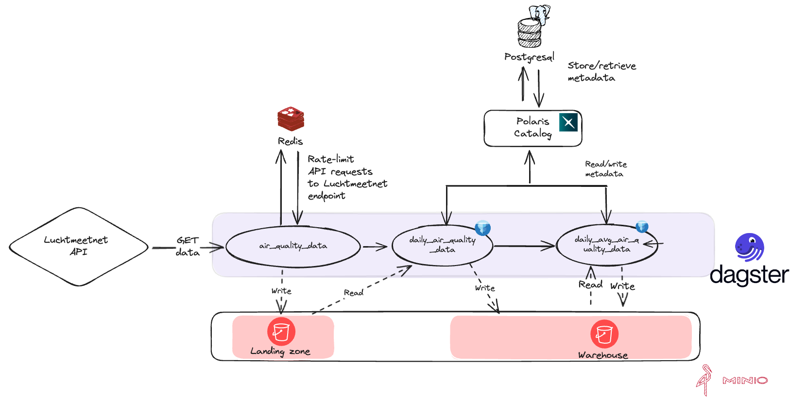

# dagster-pyiceberg example using postgresql catalog

> [!WARNING] dagster-pyiceberg is in development
>
> The `dagster-pyiceberg` library is in development.

This repository contains an example for [dagster-pyiceberg](https://jasperhg90.github.io/dagster-pyiceberg/) with a [Polaris catalog](https://polaris.apache.org/).

## The DAG

The example DAG is hosted [here](). It ingests measured air quality data for 99 stations in The Netherlands from the [Luchtmeetnet API](https://api-docs.luchtmeetnet.nl/). Read the [repository README]() for more information.



> [!info] Missing partitions
>
> Dagster will mark the `air_quality_data` asset as 'failed' because some stations return 500 errors. This is expected.

## Setup

### Cloning this repository

This repository contains submodules. You must clone it using:

```
git clone --recurse-submodules https://github.com/JasperHG90/dagster-pyiceberg-example-polaris
```

### Devcontainer

This repository contains a devcontainer that spins up all required resources using docker-compose. It sets up:

- A Redis database container to serve as a [backend](https://pyratelimiter.readthedocs.io/en/latest/modules/pyrate_limiter.buckets.redis_bucket.html) for pyrate-limiter.
- A Postgresql container that allows Polaris to persist settings, principals, tables etc. across sessions.
- A Polaris container
- [MinIO](https://min.io/) for S3-compatible storage to serve as landing zone & data warehouse. NB: Polaris does not support MinIO at this time. See <https://github.com/apache/polaris/pull/389> for status.

All required details required to connect to the above services are added to the dotenv file found in .devcontainer/.env. This dotenv file is automatically loaded in the devcontainer environment.

### Installing dependencies

Execute `just s` to install the example DAG.

### Creating a landing zone bucket

The 'warehouse' bucket is automatically created on startup, but the 'landingzone' bucket needs to be created manually (one time action). To do this, execute `just clz`.

### Configuring the Polaris catalog

Configuring the Polaris catalog is a one-time action for which you can execute `just sc`. This will set up:

- A new catalog
- A namespace within the catalog
- Principal, principal role, and catalog role needed to write to the catalog

This setup is copied from the Apache Polaris [Quickstart](https://polaris.apache.org/in-dev/unreleased/quickstart/) tutorial.

It will also write a .pyiceberg.yaml configuration file to the `/home/vscode/workspace` directory that contains the credentials with which Dagster will read and write data to the catalog. See [configuring PyIceberg](https://py.iceberg.apache.org/configuration/#rest-catalog) for more information.

## Running the example

You can run the example by executing `just dd`. The Dagster UI will be available on [localhost:3000](http://localhost:3000)

Minio is available on [localhost:9001](http://localhost:9001). Username and password are 'pyiceberg'.

## Inspecting the generated tables using `pyiceberg`

You can find Jupyter notebooks in the 'notebooks' folder.

## Inspecting the Polaris catalog

...
